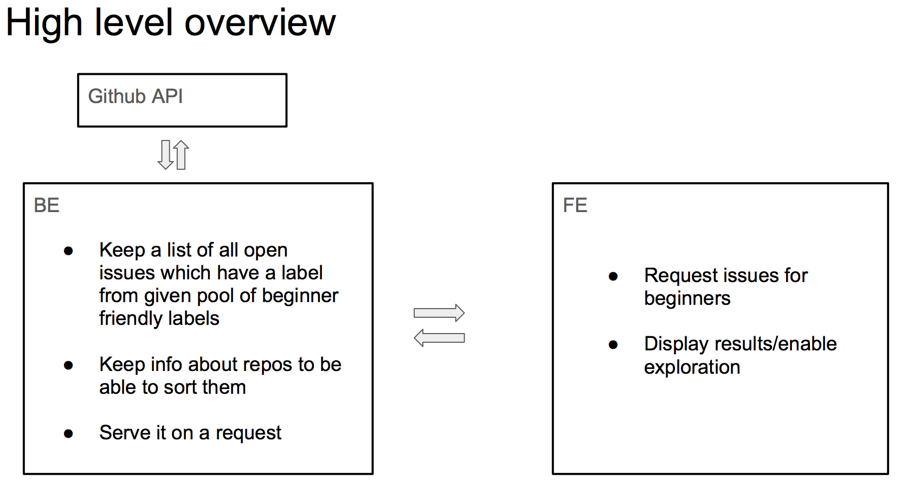

# berlin-issues-explorer-fe

Frontend part for **issues-explorer** project.

Check the current state of the project on [netlify](https://berlin-issues-explorer-fe.netlify.com/).


## issues-explorer

 **issues-explorer** project aims to make it easier to discover opensource project issues which are suitable for beginners.

There are a lot of opensource projects whose contributors apart from wanting to get new contributors, also want to support people to step into opensource community by providing clean guidelines on how to contribute, insisting on precise issue descriptions and labeling issues suitable for beginners by one of the following labels: `first-timers-only, up-for-grabs, newcomer, jump-in` etc.

**issues-explorer** project displays up to date overview of those issues allowing for filtering/grouping by programming language or other repository tags. In the next phase project should also be able to display info how much activity is happening in each repository and option to sort by most/least active ones.

# Motivation

Improve our technical and collaboration skills by developing an open-source web-application together during Women Who Code hack nights.
With this, we want to provide learning playground for Hack Evening participants who are interested in chosen technology stack. We want to make this project yours as well. Don't be shy to take ownership of parts of it :)

#



## Running the App

#### Prerequisites

Make sure npm is installed with a minimum version of 5.0.
Try
```
npm --version
```
This will show you the currently installed version of npm.
If you see an error message, you don't have npm at all. Refer to the [official installation guide](https://docs.npmjs.com/getting-started/installing-node) for how to get it.

Make sure that git is also installed:
```
which git
```
If this returns `not found`, check out this handy guide from [github.com](https://help.github.com/articles/set-up-git/).

#### Getting the app

First step is that you need to clone the app from github.
Change to a folder where you would like to install the app.
Then clone the files from github:
```
git clone git@github.com:WomenWhoCode/berlin-issues-explorer-fe.git
```

As the repository is public, you shouldn't need any verification to do this.

#### Installing Dependencies

Then switch to the new folder and the sub folder containing the code:
```
cd berlin-issues-explorer-fe/issues-berlin
```

Now we need to download and install all the dependencies. Npm will do this for us:
```
npm install
```

#### Running the app

Now you are ready to roll!
Run the following command to start the app on your local machine:
```
npm start
```
This should also open a browser window. If this does not happen, go to `localhost:3000` to see the website in action.

**Note:**
If your port 3000 is already blocked by another app, this will not work because ports can only be used by one app at a time.


## Contributing

Please review our [contributing guidelines](CONTRIBUTING.md) and enjoy collaboration!


